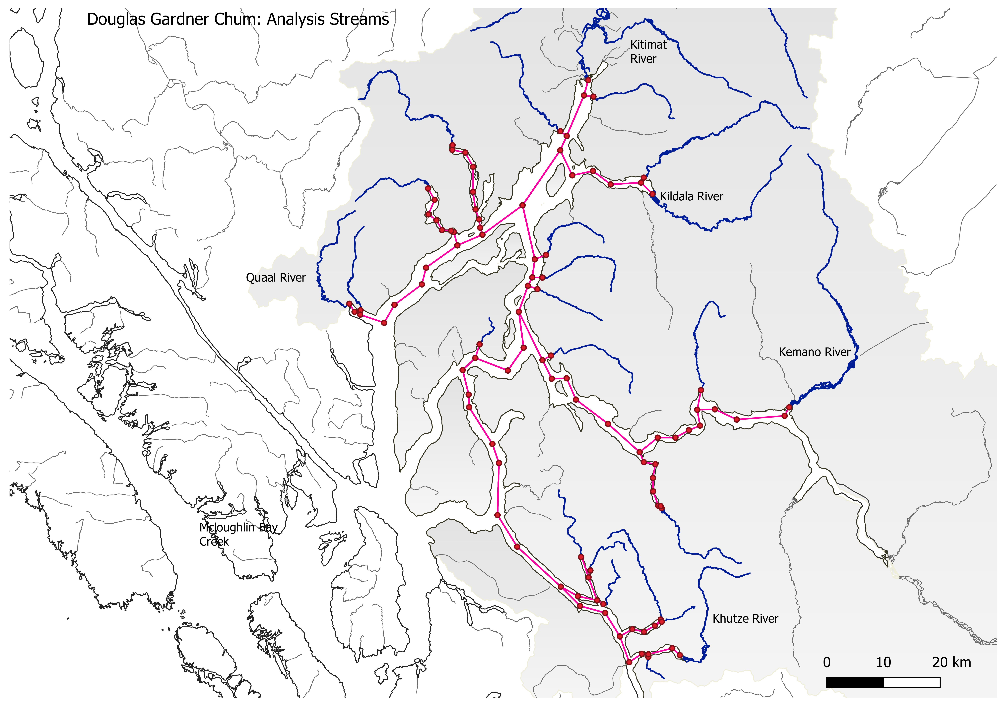

```{r setup, include=FALSE}

knitr::opts_chunk$set(echo = FALSE, warning = FALSE, message = FALSE)
knitr::opts_chunk$set(echo = TRUE, fig.pos = "!h")
options(knitr.table.format ='pdf' )

library(tidyverse)
library(jtools)
library(kableExtra)
library(flextable)
library(knitr)
library(magick)
library(dendextend)
library(corrplot)
library(ggdendro)
library(ggpubr)

# Load in objects from Area 6 data prep script

releases <- readRDS("RDS/douglas-gardner_releases.rds")
escdata <- readRDS("RDS/cm_douglasgardner_escdata.rds")
escdata.filtered <- readRDS("RDS/douglasgardner-cm_escdata_filtered.rds")
rps.clean <- readRDS("RDS/douglas-gardner_cm_rpsclean.rds")

```


\newpage

# Study area

## Douglas Gardner CU



\newpage

# Summary statistics

## Bubbleplot of escapement by enhancement rank

```{r, Bubble plot, fig.align = "center", fig.height = 7, fig.width = 6, fig.cap = "Escapement to area streams by enhancement rank.",echo = FALSE, warning = FALSE, message = FALSE}

escdata.raw<-escdata %>% filter(SPP == "CM" & Area == 8)

ggplot(escdata.raw,aes(x=Year,y=SYS_NM,color=Enhancement_Rank,size=escapement))+
  geom_point(alpha=.5)+
  scale_colour_manual(breaks=c("NONE","LOW","MOD","HIGH"),
                      values=c("grey50","steelblue","darkred","seagreen"))+
  labs(y="Escapement",color="Enhancement",x="Year",size="Escapement")+
  theme_bw()+
  theme(legend.position="bottom")+
  guides(colour = guide_legend(nrow = 4))+
  guides(size = guide_legend(nrow = 4))+ 
  theme(axis.text.x = element_text(size = 7))

#unique(escdata.raw$SYS_NM)
ggsave("figures/area 6 chum escapement data all.png",dpi=600,height=8,width=7)
```

\newpage

## Plot of total releases to area

```{r total releases for area 6 terminal not including mcloughlin bay, include = TRUE, echo = FALSE, warning = FALSE, message = FALSE, fig.align = "center", fig.height = 6, fig.width = 8, fig.cap = "Total releases for area 6 (not including McLoughlin Bay)"}

#total releases for DG

releases.DG <-releases %>% 
  filter(RELEASE_SITE_NAME%in%c("Bish Cr", "Dala R", "Hirsch Cr", "Kildala R", "Kitimat R"))

totalrel.DG <- releases.DG %>% 
  group_by(RELEASE_YEAR)%>%
  summarise(totreleases=sum(releases))%>%
  mutate(group="Douglas Gardner CU")

write.csv(totalrel.DG,"data/releases area 6 chum total terminal releases.csv")
saveRDS(totalrel.DG, "RDS/a06cm_totrel.rds")

ggplot(totalrel.DG,aes(x=RELEASE_YEAR,y=totreleases,color=group))+
  geom_point()+geom_line()+
  theme_bw()+
  geom_smooth() +
  labs(x="Release Year",y="Total Releases",title="Area 6 Chum total terminal releases")

#ggsave("figures/releases chum area 6 total terminal.png",dpi=600,height=6,width=6)

#write.csv(totrel,"~/R/PSF hatchery review/analysis/spatial/outputs/Area 25 chum releases totals.csv")
```

\newpage

## Escapement by enhancement rank per system

```{r metric plots,fig.align="center",fig.height=8,fig.width=6,fig.cap="Various plots for escapement and transformations.",echo=FALSE,warning=FALSE,message=FALSE}
#plot streams by enhancement

p1<-ggplot(escdata.filtered,aes(x=Year,y=escapement,color=Enhancement_Rank,group=SYS_NM))+
  geom_line()+
  theme_bw()+
  labs(y="Escapement",title="Raw Escapement",color="Enhancement Rank")

p2<-ggplot(escdata.filtered,aes(x=Year,y=esc.log,color=Enhancement_Rank,group=SYS_NM))+
 geom_line()+
  theme_bw()+
  labs(y="log(Escapement)",title="Logged Escapement")

p3<-ggplot(escdata.filtered,aes(x=Year,y=z,color=Enhancement_Rank,group=SYS_NM))+
  geom_line()+
  geom_hline(yintercept=0)+
  theme_bw()+
  labs(y="Z-scores (Escapement)",title="Z-scores Escapement")

p4<-ggplot(escdata.filtered,aes(x=Year,y=esc.stand,color=Enhancement_Rank,group=SYS_NM))+
  geom_line()+
  theme_bw()+
  labs(y="Standardized Escapement (pavg)",title="Escapement/Average (Pavg)")

ggarrange(p1,p2,p3,p4,ncol=1,common.legend = TRUE,align='v',legend="bottom")

```

\newpage

## Moving average and LOESSS fit on enhancement ranking of log escapements

```{r moving average and LOESS plots, echo=FALSE,warning=FALSE,message=FALSE,fig.align="center",fig.height=5,fig.width=6,fig.cap="Moving average and LOESS fits on logged escapement by enhancement ranking."}

t1<-ggplot(escdata.filtered,aes(x=Year,y=m.ave,color=Enhancement_Rank,group=SYS_NM))+
  geom_line()+
  theme_bw()+
  labs(y="Moving Average",title="Moving-Average",color="Enhancement Rank")

t2<-ggplot(escdata.filtered,aes(x=Year,y=z,color=Enhancement_Rank,group=SYS_NM))+
  geom_smooth(method="loess",se=FALSE,span=.1,linewidth=.7)+
  geom_hline(yintercept=0)+
  theme_bw()+
  labs(y="Z-score",title="Loess fit on Z-scores")

ggarrange(t1,t2,ncol=1,common.legend = TRUE,legend = "bottom",align='v')

```


\newpage

## Escapement to streams by enhancement rank

```{r, Facet plot of escapements by enhancement ranking, echo = FALSE, message = FALSE, warning = FALSE, fig.align = "center", fig.height = 7, fig.width = 8, fig.cap = "Facet plot of escapements by enhancement level"}

ggplot(escdata.filtered,aes(x=Year,y=escapement,color=Enhancement_Rank))+
  geom_point()+geom_line()+theme_bw()+
  facet_wrap(~SYS_NM,ncol=3,scale="free_y")+
  labs(y="Escapement",color="Enhancement Level",title="Area 6 Escapement (filtered streams)")+
  theme(legend.position="bottom")

ggsave("figures/area 6 chum escapement filtered streams.png",dpi=600,height=8,width=7)

```

\newpage

## Facet plot of all releases in Area 6

```{r, Facet plot of all releases in Area 6, echo = FALSE, message = FALSE, warning = FALSE, fig.align = "center", fig.height = 7, fig.width = 8, fig.cap = "Facet plot of all releases in area 6"}

species="Chum"
rel.cu.name= "Douglas Gardner CU"
fy=1980

ggplot(releases,aes(x=RELEASE_YEAR,y=releases,color=RELEASE_STAGE_NAME,group=grp))+
  geom_line()+geom_point()+
  scale_color_brewer(palette="Set1")+
  facet_wrap(~`site-stock`,ncol=4)+
  theme_bw()+
  labs(x="Release Year",y="Releases",color="Release Stage",
       title=paste0(species,": ",paste0(rel.cu.name,collapse=" ")),subtitle="Release site:Origin stock")+
  theme(legend.position = "bottom",
        plot.title=element_text(size=8),strip.text=element_text(size=8))

```

\newpage

## Recruits per spawner by system

```{r, Plotting RPS by system, echo = FALSE, message = FALSE, warning = FALSE, fig.align = "center", fig.height = 7, fig.width = 8, fig.cap = "Recruits per spawner by system"}

# RPS by system

ggplot(rps.clean,aes(x=Year,y=rps))+
  geom_line()+geom_point()+
  geom_smooth(method='lm',se=TRUE)+
  facet_wrap(~SYS_NM,ncol=3,scale="free_y")+
  theme_bw()+
  geom_hline(yintercept=1)

```

\newpage

## Log recruits per spawner by system

```{r, Log recruits per spawner by system, echo = FALSE, message = FALSE, warning = FALSE, fig.align = "center", fig.height = 7, fig.width = 8, fig.cap = "Log recruits per spawner by system"}

# Log RPS by system

logrps<-rps.clean%>%select(Year,prepost,logrps,SYS_NM)%>%arrange(SYS_NM,prepost,Year)

idx <- c(1, diff(logrps$Year))
i2 <- c(1,which(idx != 1), nrow(logrps)+1)
logrps$grp <- rep(1:length(diff(i2)), diff(i2))
logrps <- logrps[1:930,]

ggplot(logrps,aes(x=Year,y=logrps,color=prepost,group=grp))+
  geom_line(alpha=.5)+geom_point(alpha=.5)+
  scale_color_brewer(palette="Set1")+
  geom_smooth(method='lm',se=TRUE)+
  facet_wrap(~SYS_NM,ncol=3,scale="free_y")+
  theme_bw()+
  geom_vline(xintercept=fy,color="seagreen")+
  geom_hline(yintercept=0,linetype="dashed")+
  labs(x="Brood Year",y="log(Recruits per spawner)",color="Period",title="Area 6 Chum")+
  theme(legend.position="bottom")

ggsave("figures/area 6 chum log rps pre vs post.png",dpi=600,height=8,width=7)

```

\newpage

## Boxplot of log RPS by system

```{r, Boxplot of log RPS by system, echo = FALSE, message = FALSE, warning = FALSE, fig.align = "center", fig.height = 7, fig.width = 8, fig.cap = "Boxplot of log recruits per spawner by system"}

ggplot(logrps,aes( y = SYS_NM, x = logrps, fill = prepost))+
  geom_boxplot(notch=F)+
  scale_fill_brewer(palette="Set1")+
  geom_vline(xintercept=0)+
  theme_bw()+
  labs(y="System Name",x="log(Recruits per spawner)",title="Area 6 Chum")+
  theme(legend.position="bottom")

ggsave("figures/area 6 chum log rps pre vs post boxplot.png",dpi=600,height=8,width=7)

```
\newpage

## Table of Douglas Gardner CU by distance from enhancement


```{r, Kable of distances by inlet, echo = FALSE, warning = FALSE, message = FALSE, fig.align="center", fig.height = 7, fig.width = 7}

streaminlet <- read_csv("data/douglas gardner stream distances.csv")
streaminlet <- streaminlet[,2:3]

colnames(streaminlet) <- c("Stream", "Dist. from enhancement")

kable(streaminlet, format = "latex")

```

\newpage

# Correlation analyses

## Cross correlation plots
```{r, Correlation analyses, echo = FALSE, message = FALSE, warning = FALSE}

rps.clean <- readRDS("RDS/douglas-gardner_cm_rpsclean.rds")
#escdata.filtered <- readRDS("RDS/douglasgardner-cm_escdata_filtered.rds") %>%
#  select(SYS_NM, Year, esc.log, z, m.ave, esc.stand)

cor.data.z<-rps.clean%>%select(SYS_NM,Year,z)%>%
  pivot_wider(names_from="Year",values_from="z")%>%
  data.frame()
rownames(cor.data.z)<-cor.data.z$SYS_NM
cor.data.z<-cor.data.z%>%select(-SYS_NM)
cor.z<-cor(t(cor.data.z),use="pairwise.complete.obs")
dist.cor.z<- dist(cor.z)
clust.dist.cor.z <- hclust(dist.cor.z)
dendclust.z <- dendro_data(clust.dist.cor.z)

cor.data.e<-rps.clean%>%select(SYS_NM,Year,esc.log)%>%
  pivot_wider(names_from="Year",values_from="esc.log")%>%
  data.frame()
rownames(cor.data.e)<-cor.data.e$SYS_NM
cor.data.e<-cor.data.e%>%select(-SYS_NM)
cor.e<-cor(t(cor.data.e),use="pairwise.complete.obs")
dist.cor.e<- dist(cor.e)
clust.dist.cor.e <- hclust(dist.cor.e)
dendclust.e <- dendro_data(clust.dist.cor.e)


cor.data.s<-rps.clean%>%select(SYS_NM,Year,esc.stand)%>%
  pivot_wider(names_from="Year",values_from="esc.stand")%>%
  data.frame()
rownames(cor.data.s)<-cor.data.s$SYS_NM
cor.data.s<-cor.data.s%>%select(-SYS_NM)
cor.s<-cor(t(cor.data.s),use="pairwise.complete.obs")
dist.cor.s<- dist(cor.s)
clust.dist.cor.s <- hclust(dist.cor.s)
dendclust.s <- dendro_data(clust.dist.cor.s)


cor.data.m<-rps.clean%>%select(SYS_NM,Year,m.ave)%>%
  pivot_wider(names_from="Year",values_from="m.ave")%>%
  data.frame()
rownames(cor.data.m)<-cor.data.m$SYS_NM
cor.data.m<-cor.data.m%>%select(-SYS_NM)
cor.m<-cor(t(cor.data.m),use="pairwise.complete.obs")
dist.cor.m<- dist(cor.m)
clust.dist.cor.m <- hclust(dist.cor.m)
dendclust.m <- dendro_data(clust.dist.cor.m)


cor.data.rps<-rps.clean%>%select(SYS_NM,Year,rps)%>%
  pivot_wider(names_from="Year",values_from="rps")%>%
  data.frame()
rownames(cor.data.rps)<-cor.data.rps$SYS_NM
cor.data.rps<-cor.data.rps%>%select(-SYS_NM)
cor.rps<-cor(t(cor.data.rps),use="pairwise.complete.obs")
dist.cor.rps<- dist(cor.rps)
clust.dist.cor.rps <- hclust(dist.cor.rps)
dendclust.rps <- dendro_data(clust.dist.cor.rps)


cor.data.rpslog<-rps.clean%>%select(SYS_NM,Year,logrps)%>%
  pivot_wider(names_from="Year",values_from="logrps")%>%
  data.frame()
rownames(cor.data.rpslog)<-cor.data.rpslog$SYS_NM
cor.data.rpslog<-cor.data.rpslog%>%select(-SYS_NM)
cor.rpslog<-cor(t(cor.data.rpslog),use="pairwise.complete.obs")
dist.cor.rpslog<- dist(cor.rpslog)
clust.dist.cor.rpslog <- hclust(dist.cor.rpslog)
dendclust.rpslog <- dendro_data(clust.dist.cor.rpslog)

```

```{r, Correlation plots by metric, echo = FALSE, message = FALSE, error = FALSE, fig.align = "center", fig.height = 9.5, fig.width = 8.5, fig.cap = "Cross correlation plots to compare metrics."}
par(oma=c(0,0,0,0))
par(mfrow=c(3,2))

corrplot(cor.z, diag = FALSE, order="hclust", method="square", tl.col="black",
         addrect = 6, tl.cex = 0.45, title = "Z-scores", mar=c(0,0,3,0))
corrplot(cor.e, diag = FALSE, order="hclust", method="square", tl.col="black",
         addrect = 6, tl.cex = 0.45, title = "Log escapement", mar=c(0,0,3,0))
corrplot(cor.s, diag = FALSE, order="hclust", method="square", tl.col="black",
         addrect = 6, tl.cex = 0.45, title = "Standardized escapement", mar=c(0,0,3,0))
corrplot(cor.m, diag = FALSE, order="hclust", method="square", tl.col="black",
         addrect = 6, tl.cex = 0.45, title = "Moving average", mar=c(0,0,3,0))
corrplot(cor.rps, diag = FALSE, order="hclust", method="square", tl.col="black",
         addrect = 6, tl.cex = 0.45, title = "RPS", mar=c(0,0,3,0))
corrplot(cor.rpslog, diag = FALSE, order="hclust", method="square", tl.col="black",
         addrect = 6, tl.cex = 0.45, title = "Log RPS", mar=c(0,0,3,0))

```

\newpage

## Dendrogram clusters analysis

```{r, Dendrogram plots, echo = FALSE, message = FALSE, warning = FALSE,  fig.align = "center", fig.height = 9.5, fig.width = 8.5, fig.cap = "Dendrogram cluster analysis to compare uses of different metrics."}

par(oma=c(0,0,0,0))
par(mfrow=c(3,2))

clust.dist.cor.z[["labels"]] <- str_to_sentence(word(clust.dist.cor.z[["labels"]]))
dendz <- as.dendrogram(clust.dist.cor.z)
dendz %>%
    #set("labels_colors", zlabs) %>%
    plot(main = "Z-scores", horiz = TRUE)

clust.dist.cor.e[["labels"]] <- str_to_sentence(word(clust.dist.cor.e[["labels"]]))
dende <- as.dendrogram(clust.dist.cor.e)
dende %>%
    #set("labels_colors", elabs) %>%
    plot(main = "Log escapement", horiz = TRUE)

clust.dist.cor.s[["labels"]] <- str_to_sentence(word(clust.dist.cor.s[["labels"]]))
dends <- as.dendrogram(clust.dist.cor.s)
dends %>%
    #set("labels_colors", slabs) %>%
    plot(main = "Standardized escapement", horiz = TRUE)

clust.dist.cor.m[["labels"]] <- str_to_sentence(word(clust.dist.cor.m[["labels"]]))
dendm <- as.dendrogram(clust.dist.cor.m)
dendm %>%
    #set("labels_colors", mlabs) %>%
    plot(main = "Moving average", horiz = TRUE)

clust.dist.cor.rps[["labels"]] <- str_to_sentence(word(clust.dist.cor.rps[["labels"]]))
dendrps <- as.dendrogram(clust.dist.cor.rps)
dendrps %>%
    #set("labels_colors", rpslabs) %>%
    plot(main = "RPS", horiz = TRUE)

clust.dist.cor.rpslog[["labels"]] <- str_to_sentence(word(clust.dist.cor.rpslog[["labels"]]))
dendrpslog <- as.dendrogram(clust.dist.cor.rpslog)
dendrpslog %>%
    #set("labels_colors", rpsloglabs) %>%
    plot(main = "Log RPS", horiz = TRUE)
```
\newpage

## Tanglegrams

```{r, Tanglegrams z v log, echo = FALSE, message = FALSE, warning = FALSE, fig.align = "center", fig.height = 9.5, fig.width = 8.5, fig.cap = "Tanglegram of z-score vs. logged escapements"}

#png(file = "figures/a06cm_tanglegram_z_v_log.png", width = 2000, height = 3000, pointsize = 36)

par(oma=c(2,2,2,2))
par(mfrow=c(1,1))

tangle1 <- dendlist(dendz, dende)
                                                                                                            
tanglegram(tangle1, lab.cex = .8, margin_inner = 3, main_left = "Z-score",
           main_right = "Log escapement", cex_main = 1, highlight_distinct_edges = FALSE,
           lwd = 2, edge.lwd = 1)

#dev.off()

```

\newpage

```{r, Tanglegrams z vs std. esc, echo = FALSE, message = FALSE, warning = FALSE, fig.align = "center", fig.height = 9.5, fig.width = 8.5, fig.cap = "Tanglegram of z-score vs. standardized escapements"}

#png(file = "figures/a06cm_tanglegram_z_v_stdesc.png", width = 2000, height = 3000, pointsize = 36)

tangle2 <- dendlist(dendz, dends)
                                                                                                            
tanglegram(tangle2, lab.cex = .8, margin_inner = 3, main_left = "Z-score",
           main_right = "Standardized escapement", cex_main = 1, highlight_distinct_edges = FALSE,
           lwd = 2, edge.lwd = 1)

#dev.off()
```

\newpage

```{r, Tanglegrams z vs m.ave, echo = FALSE, message = FALSE, warning = FALSE, fig.align = "center", fig.height = 9.5, fig.width = 8.5, fig.cap = "Tanglegram of z-score vs. moving average"}

#png(file = "figures/a06cm_tanglegram_z_v_mave.png", width = 2000, height = 3000, pointsize = 36)

tangle3 <- dendlist(dendz, dendm)
                                                                                                            
tanglegram(tangle3, lab.cex = .8, margin_inner = 3, main_left = "Z-score",
           main_right = "Moving average", cex_main = 1, highlight_distinct_edges = FALSE,
           lwd = 2, edge.lwd = 1)

#dev.off()

```

\newpage

```{r, Tanglegrams z vs logRPS, echo = FALSE, message = FALSE, warning = FALSE, fig.align = "center", fig.height = 9.5, fig.width = 8.5, fig.cap = "Tanglegram of z-score vs. moving average"}

#png(file = "figures/a06cm_tanglegram_z_v_mave.png", width = 2000, height = 3000, pointsize = 36)

tangle4 <- dendlist(dendz, dendrpslog)
                                                                                                            
tanglegram(tangle4, lab.cex = .8, margin_inner = 3, main_left = "Z-score",
           main_right = "Log RPS", cex_main = 1, highlight_distinct_edges = FALSE,
           lwd = 2, edge.lwd = 1)

#dev.off()

```
\newpage

# Statistical models

```{r, Statistical models, echo = FALSE, message = FALSE, warning = FALSE, include = FALSE}

rps.clean <- readRDS("RDS/douglas-gardner_cm_rpsclean.rds")

streams <- streaminlet
colnames(streams) <- c("SYS_NM", "dist")

rps.clean <- merge(rps.clean, streams, by = "SYS_NM", all = TRUE)

totrels <- readRDS("RDS/a06cm_totrel.rds")
totrels <- totrels[,1:2]
colnames(totrels) <- c("Year", "totrel")
totrels <- totrels[1:32,]

rps.clean <- merge(rps.clean, totrels, by = "Year", all = TRUE)
rps.clean$totrel[is.na(rps.clean$totrel)] <- 0

# RPS MODELS

a <- glm(logrps ~ dist, 
         data = rps.clean)
summary(a)

b <- glm(logrps ~ Year, 
         data = rps.clean)
summary(b)

c <- glm(logrps ~ totrel, 
         data = rps.clean)
summary(c)

d <- glm(logrps ~ dist + Year,
         data = rps.clean)
summary(d)

e <- glm(logrps ~ dist + totrel,
         data = rps.clean)
summary(e)

f <- glm(logrps ~ dist + totrel + Year,
         data = rps.clean)
summary(f)

AIC(a, b, c, d, e, f)


# ESCAPEMENT MODELS

ea <- glm(esc.log ~ dist, 
         data = rps.clean)
summary(ea)

eb <- glm(esc.log ~ Year, 
         data = rps.clean)
summary(eb)

ec <- glm(esc.log ~ totrel, 
         data = rps.clean)
summary(ec)

ed <- glm(esc.log ~ dist + Year,
         data = rps.clean)
summary(ed)

ee <- glm(esc.log ~ dist + totrel,
         data = rps.clean)
summary(ee)

ef <- glm(esc.log ~ dist + totrel + Year,
         data = rps.clean)
summary(ef)

AIC(ea, eb, ec, ed, ee, ef)

```

```{r, Model summary tables, echo = FALSE, warning = FALSE, message = FALSE}
candidates <- read_csv("data/area 6 chum candidate models.csv")

rpscands <- as.data.frame(rbind(candidates[1:6,]))
esccands <- as.data.frame(rbind(candidates[7:12,]))

rpsaic <- AIC(a, b, c, d, e, f)
escaic <- AIC(ea, eb, ec, ed, ee, ef)

rpscands$df <- rpsaic$df
rpscands$AIC <- rpsaic$AIC
rpscands <- rpscands %>%
  arrange(AIC)

esccands$df <- escaic$df
esccands$AIC <- escaic$AIC
esccands <- esccands %>%
  arrange(AIC)

```

## Table of log RPS candidate models and AIC selection

```{r, Log RPS candidate models and AIC selection, echo = FALSE, warning = FALSE, message = FALSE}
kable(rpscands, format = "latex")

```

\newpage

## Table of log escapement candidate models and AIC selection

```{r, Log escapement candidate models and AIC selection, echo = FALSE, warning = FALSE, message = FALSE}
kable(esccands, format = "latex")

```

\newpage

## Effects plot of log RPS against releases to area

```{r, Effects plot of log RPS against releases to area, message = FALSE, echo = FALSE, warning = FALSE}

effect_plot(f, pred = totrel, interval = TRUE, plot.points = TRUE, x.label = "Total releases to area", y.label = "Log recruits per spawner")

```

\newpage

## Effects plot of log RPS against year

```{r, Effects plot of log RPS against year, message = FALSE, echo = FALSE, warning = FALSE}

effect_plot(f, pred = Year, interval = TRUE, plot.points = TRUE, x.label = "Year", y.label = "Log recruits per spawner")

```

\newpage

## Effects plot of log Escapement against distance from enhancement

```{r, Effects plot of log escapement against distance, message = FALSE, echo = FALSE, warning = FALSE}

effect_plot(ed, pred = dist, interval = TRUE, plot.points = TRUE, x.label = "Distance from enhancement (km)", y.label = "Log escapement")

```

\newpage

## Effects plot of log Escapement against year

```{r, Effects plot of log escapement against year, message = FALSE, echo = FALSE, warning = FALSE}

effect_plot(ed, pred = Year, interval = TRUE, plot.points = TRUE, x.label = "Year", y.label = "Log escapement")

```
